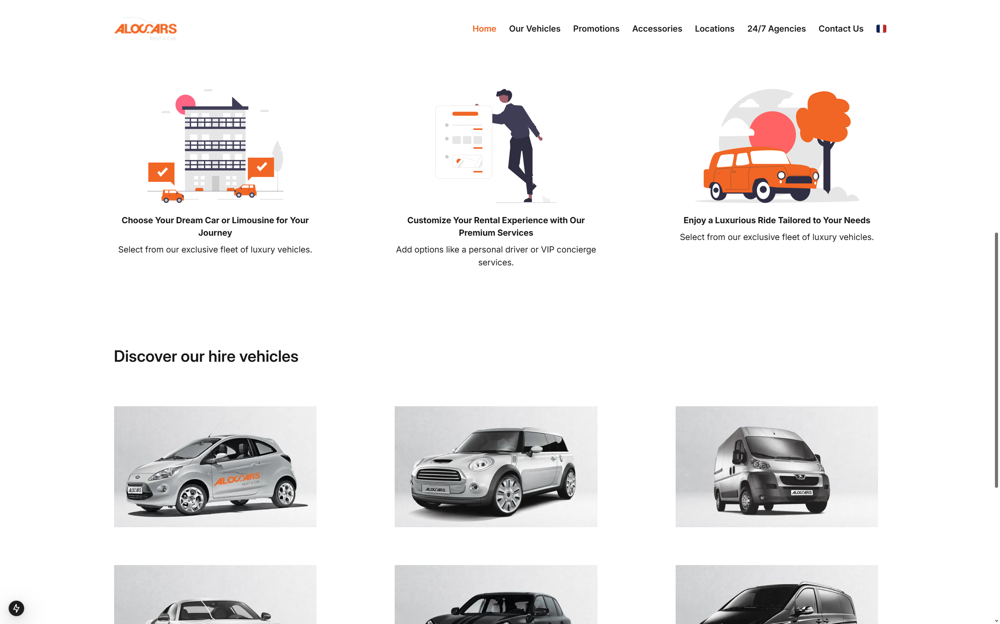

# Aloc-Cars 🚗

Aloc-Cars is a car rental web application developed for the Swiss-based company [aloccars.ch](https://www.aloccars.ch). The project is currently under development and features a robust backend built with **Symfony** and a responsive frontend using **Next.js**.

This app aims to streamline the process of searching, booking, and managing car rentals online with a user-friendly interface and solid backend architecture.

---

## 📱 Features

- Vehicle browsing with filters (brand, model, availability)
- Booking system with date selection
- Admin panel for car and reservation management
- Secure authentication and session management
- Dynamic frontend with optimized performance
- Multilingual support (planned)

---

## 🛠️ Technologies Used

- [Symfony](https://symfony.com/) – Backend API & business logic  
- [Next.js](https://nextjs.org/) – Frontend UI and SSR  
- [TypeScript](https://www.typescriptlang.org/)  
- [Tailwind CSS](https://tailwindcss.com/)  
- [MySQL](https://www.mysql.com/) – Database  
- [Axios](https://axios-http.com/) – API communication  

---

## 📸 Screenshot

---

## 💡 Project Goals

The main goal of Aloc-Cars is to provide a smooth and intuitive rental experience for customers, while giving administrators the tools they need to efficiently manage the fleet and reservations. The project also serves as a full-stack showcase combining Symfony and Next.js in a real-world business setting.

---
